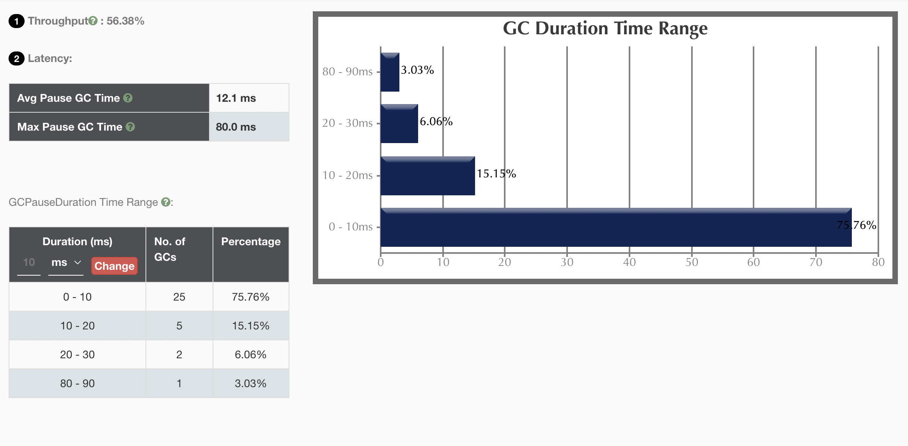
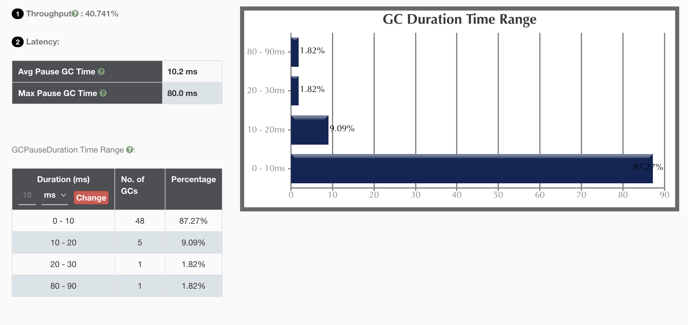
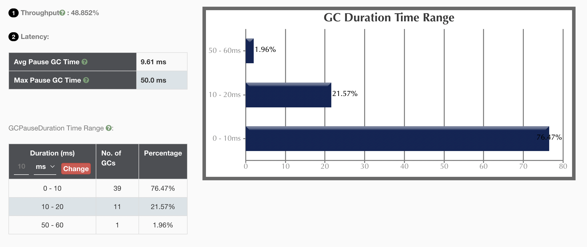
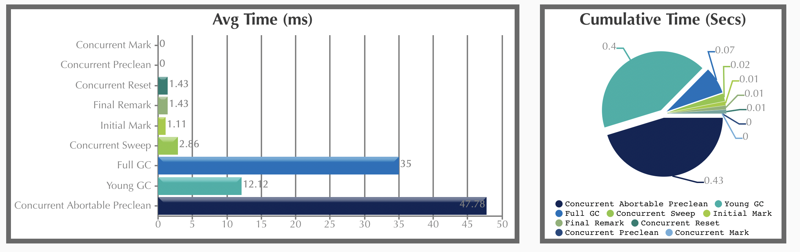
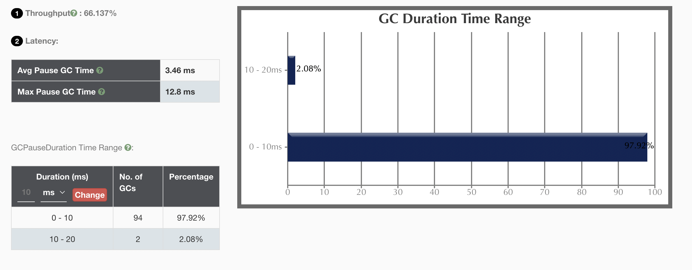

# 串行/并行/CMS/G1垃圾回收器例子以及不同 GC 和堆内存特点分析

## 准备案例代码

```java
import java.util.Random;
import java.util.concurrent.TimeUnit;
import java.util.concurrent.atomic.LongAdder;
/*
演示GC日志生成与解读
*/
public class GCLogAnalysis {
    private static Random random = new Random();
    public static void main(String[] args) {
        // 当前毫秒时间戳
        long startMillis = System.currentTimeMillis();
        // 持续运行毫秒数; 可根据需要进行修改
        long timeoutMillis = TimeUnit.SECONDS.toMillis(1);
        // 结束时间戳
        long endMillis = startMillis + timeoutMillis;
        LongAdder counter = new LongAdder();
        System.out.println("正在执行...");
        // 缓存一部分对象; 进入老年代
        int cacheSize = 2000;
        Object[] cachedGarbage = new Object[cacheSize];
        // 在此时间范围内,持续循环
        while (System.currentTimeMillis() < endMillis) {
            // 生成垃圾对象
            Object garbage = generateGarbage(100*1024);
            counter.increment();
            int randomIndex = random.nextInt(2 * cacheSize);
            if (randomIndex < cacheSize) {
                cachedGarbage[randomIndex] = garbage;
            }
        }
        System.out.println("执行结束!共生成对象次数:" + counter.longValue());
    }

    // 生成对象
    private static Object generateGarbage(int max) {
        int randomSize = random.nextInt(max);
        int type = randomSize % 4;
        Object result = null;
        switch (type) {
            case 0:
                result = new int[randomSize];
                break;
            case 1:
                result = new byte[randomSize];
                break;
            case 2:
                result = new double[randomSize];
                break;
            default:
                StringBuilder builder = new StringBuilder();
                String randomString = "randomString-Anything";
                while (builder.length() < randomSize) {
                    builder.append(randomString);
                    builder.append(max);
                    builder.append(randomSize);
                }
                result = builder.toString();
                break;
        }
        return result;
    }
}
```

确保为 Java 8 环境。

```bash
$ java -version
openjdk version "1.8.0_322"
OpenJDK Runtime Environment (Zulu 8.60.0.21-CA-macos-aarch64) (build 1.8.0_322-b06)
OpenJDK 64-Bit Server VM (Zulu 8.60.0.21-CA-macos-aarch64) (build 25.322-b06, mixed mode)
```

编译代码。

```bash
$ javac GCLogAnalysis.java
```

## 串行 GC

### 使用串行 GC 运行程序

```bash
$ java -XX:+PrintGCDetails -Xmx1g -Xms1g -XX:+PrintGCDateStamps -XX:+UseSerialGC GCLogAnalysis
正在执行...
2022-05-10T19:53:46.221+0800: [GC (Allocation Failure) 2022-05-10T19:53:46.221+0800: [DefNew: 279616K->34944K(314560K), 0.0335172 secs] 279616K->86884K(1013632K), 0.0335580 secs] [Times: user=0.01 sys=0.02, real=0.03 secs]
2022-05-10T19:53:46.291+0800: [GC (Allocation Failure) 2022-05-10T19:53:46.291+0800: [DefNew: 314197K->34943K(314560K), 0.0242907 secs] 366138K->168023K(1013632K), 0.0243324 secs] [Times: user=0.01 sys=0.02, real=0.02 secs]
2022-05-10T19:53:46.334+0800: [GC (Allocation Failure) 2022-05-10T19:53:46.334+0800: [DefNew: 314559K->34943K(314560K), 0.0147897 secs] 447639K->241683K(1013632K), 0.0148180 secs] [Times: user=0.01 sys=0.00, real=0.01 secs]
2022-05-10T19:53:46.364+0800: [GC (Allocation Failure) 2022-05-10T19:53:46.364+0800: [DefNew: 314559K->34943K(314560K), 0.0128357 secs] 521299K->324621K(1013632K), 0.0128637 secs] [Times: user=0.01 sys=0.01, real=0.01 secs]
2022-05-10T19:53:46.391+0800: [GC (Allocation Failure) 2022-05-10T19:53:46.391+0800: [DefNew: 314161K->34941K(314560K), 0.0142919 secs] 603839K->409646K(1013632K), 0.0143169 secs] [Times: user=0.01 sys=0.01, real=0.01 secs]
2022-05-10T19:53:46.421+0800: [GC (Allocation Failure) 2022-05-10T19:53:46.421+0800: [DefNew: 314557K->34940K(314560K), 0.0173047 secs] 689262K->497818K(1013632K), 0.0173386 secs] [Times: user=0.00 sys=0.01, real=0.01 secs]
2022-05-10T19:53:46.453+0800: [GC (Allocation Failure) 2022-05-10T19:53:46.453+0800: [DefNew: 314556K->34943K(314560K), 0.0159351 secs] 777434K->580624K(1013632K), 0.0159680 secs] [Times: user=0.00 sys=0.00, real=0.01 secs]
2022-05-10T19:53:46.485+0800: [GC (Allocation Failure) 2022-05-10T19:53:46.485+0800: [DefNew: 314559K->34943K(314560K), 0.0135042 secs] 860240K->656590K(1013632K), 0.0135360 secs] [Times: user=0.00 sys=0.01, real=0.01 secs]
2022-05-10T19:53:46.514+0800: [GC (Allocation Failure) 2022-05-10T19:53:46.514+0800: [DefNew: 314420K->314420K(314560K), 0.0000114 secs]2022-05-10T19:53:46.515+0800: [Tenured: 621646K->368892K(699072K), 0.0823285 secs] 936067K->368892K(1013632K), [Metaspace: 2730K->2730K(1056768K)], 0.0823757 secs] [Times: user=0.02 sys=0.04, real=0.08 secs]
2022-05-10T19:53:46.609+0800: [GC (Allocation Failure) 2022-05-10T19:53:46.609+0800: [DefNew: 279616K->34944K(314560K), 0.0071370 secs] 648508K->459649K(1013632K), 0.0071583 secs] [Times: user=0.01 sys=0.00, real=0.01 secs]
2022-05-10T19:53:46.630+0800: [GC (Allocation Failure) 2022-05-10T19:53:46.630+0800: [DefNew: 314560K->34944K(314560K), 0.0092733 secs] 739265K->532333K(1013632K), 0.0092945 secs] [Times: user=0.01 sys=0.00, real=0.01 secs]
2022-05-10T19:53:46.653+0800: [GC (Allocation Failure) 2022-05-10T19:53:46.653+0800: [DefNew: 314560K->34944K(314560K), 0.0083418 secs] 811949K->612735K(1013632K), 0.0083631 secs] [Times: user=0.01 sys=0.01, real=0.01 secs]
2022-05-10T19:53:46.675+0800: [GC (Allocation Failure) 2022-05-10T19:53:46.675+0800: [DefNew: 314560K->34943K(314560K), 0.0103203 secs] 892351K->692878K(1013632K), 0.0103487 secs] [Times: user=0.01 sys=0.00, real=0.01 secs]
2022-05-10T19:53:46.699+0800: [GC (Allocation Failure) 2022-05-10T19:53:46.699+0800: [DefNew: 314559K->314559K(314560K), 0.0000085 secs]2022-05-10T19:53:46.699+0800: [Tenured: 657934K->393259K(699072K), 0.0264598 secs] 972494K->393259K(1013632K), [Metaspace: 2730K->2730K(1056768K)], 0.0265136 secs] [Times: user=0.03 sys=0.00, real=0.03 secs]
2022-05-10T19:53:46.740+0800: [GC (Allocation Failure) 2022-05-10T19:53:46.741+0800: [DefNew: 279616K->34943K(314560K), 0.0046948 secs] 672875K->484475K(1013632K), 0.0047159 secs] [Times: user=0.01 sys=0.00, real=0.00 secs]
2022-05-10T19:53:46.759+0800: [GC (Allocation Failure) 2022-05-10T19:53:46.759+0800: [DefNew: 314559K->34943K(314560K), 0.0061771 secs] 764091K->572947K(1013632K), 0.0061999 secs] [Times: user=0.01 sys=0.00, real=0.01 secs]
2022-05-10T19:53:46.778+0800: [GC (Allocation Failure) 2022-05-10T19:53:46.778+0800: [DefNew: 314559K->34943K(314560K), 0.0060339 secs] 852563K->645376K(1013632K), 0.0060534 secs] [Times: user=0.01 sys=0.00, real=0.01 secs]
2022-05-10T19:53:46.797+0800: [GC (Allocation Failure) 2022-05-10T19:53:46.797+0800: [DefNew: 314559K->314559K(314560K), 0.0000098 secs]2022-05-10T19:53:46.797+0800: [Tenured: 610432K->400477K(699072K), 0.0199675 secs] 924992K->400477K(1013632K), [Metaspace: 2730K->2730K(1056768K)], 0.0200047 secs] [Times: user=0.02 sys=0.00, real=0.02 secs]
2022-05-10T19:53:46.832+0800: [GC (Allocation Failure) 2022-05-10T19:53:46.832+0800: [DefNew: 279616K->34943K(314560K), 0.0055335 secs] 680093K->482852K(1013632K), 0.0055531 secs] [Times: user=0.01 sys=0.00, real=0.00 secs]
2022-05-10T19:53:46.850+0800: [GC (Allocation Failure) 2022-05-10T19:53:46.850+0800: [DefNew: 314559K->34943K(314560K), 0.0086254 secs] 762468K->574342K(1013632K), 0.0086438 secs] [Times: user=0.01 sys=0.00, real=0.00 secs]
2022-05-10T19:53:46.872+0800: [GC (Allocation Failure) 2022-05-10T19:53:46.872+0800: [DefNew: 314559K->34943K(314560K), 0.0057738 secs] 853958K->654675K(1013632K), 0.0057913 secs] [Times: user=0.00 sys=0.00, real=0.00 secs]
2022-05-10T19:53:46.891+0800: [GC (Allocation Failure) 2022-05-10T19:53:46.891+0800: [DefNew: 314559K->314559K(314560K), 0.0000074 secs]2022-05-10T19:53:46.891+0800: [Tenured: 619731K->377415K(699072K), 0.0220380 secs] 934291K->377415K(1013632K), [Metaspace: 2730K->2730K(1056768K)], 0.0220763 secs] [Times: user=0.02 sys=0.00, real=0.02 secs]
2022-05-10T19:53:46.926+0800: [GC (Allocation Failure) 2022-05-10T19:53:46.926+0800: [DefNew: 279616K->34943K(314560K), 0.0046880 secs] 657031K->467157K(1013632K), 0.0047093 secs] [Times: user=0.00 sys=0.00, real=0.01 secs]
2022-05-10T19:53:46.944+0800: [GC (Allocation Failure) 2022-05-10T19:53:46.944+0800: [DefNew: 314559K->34943K(314560K), 0.0067175 secs] 746773K->543097K(1013632K), 0.0067400 secs] [Times: user=0.01 sys=0.00, real=0.01 secs]
2022-05-10T19:53:46.964+0800: [GC (Allocation Failure) 2022-05-10T19:53:46.964+0800: [DefNew: 314559K->34943K(314560K), 0.0057270 secs] 822713K->619642K(1013632K), 0.0057495 secs] [Times: user=0.01 sys=0.00, real=0.00 secs]
2022-05-10T19:53:46.981+0800: [GC (Allocation Failure) 2022-05-10T19:53:46.981+0800: [DefNew: 314485K->34944K(314560K), 0.0072457 secs] 899183K->697972K(1013632K), 0.0072636 secs] [Times: user=0.01 sys=0.01, real=0.00 secs]
2022-05-10T19:53:47.002+0800: [GC (Allocation Failure) 2022-05-10T19:53:47.002+0800: [DefNew: 314560K->314560K(314560K), 0.0000069 secs]2022-05-10T19:53:47.002+0800: [Tenured: 663028K->408847K(699072K), 0.0181777 secs] 977588K->408847K(1013632K), [Metaspace: 2730K->2730K(1056768K)], 0.0182147 secs] [Times: user=0.02 sys=0.00, real=0.02 secs]
2022-05-10T19:53:47.033+0800: [GC (Allocation Failure) 2022-05-10T19:53:47.033+0800: [DefNew: 279616K->34943K(314560K), 0.0047428 secs] 688463K->499234K(1013632K), 0.0047655 secs] [Times: user=0.01 sys=0.00, real=0.00 secs]
2022-05-10T19:53:47.050+0800: [GC (Allocation Failure) 2022-05-10T19:53:47.050+0800: [DefNew: 314559K->34943K(314560K), 0.0061237 secs] 778850K->568292K(1013632K), 0.0061390 secs] [Times: user=0.01 sys=0.00, real=0.00 secs]
2022-05-10T19:53:47.069+0800: [GC (Allocation Failure) 2022-05-10T19:53:47.069+0800: [DefNew: 314559K->34943K(314560K), 0.0058749 secs] 847908K->650876K(1013632K), 0.0058955 secs] [Times: user=0.00 sys=0.00, real=0.01 secs]
2022-05-10T19:53:47.087+0800: [GC (Allocation Failure) 2022-05-10T19:53:47.087+0800: [DefNew: 314470K->314470K(314560K), 0.0000073 secs]2022-05-10T19:53:47.087+0800: [Tenured: 615932K->409007K(699072K), 0.0222799 secs] 930402K->409007K(1013632K), [Metaspace: 2730K->2730K(1056768K)], 0.0223144 secs] [Times: user=0.02 sys=0.00, real=0.02 secs]
2022-05-10T19:53:47.122+0800: [GC (Allocation Failure) 2022-05-10T19:53:47.122+0800: [DefNew: 279616K->34943K(314560K), 0.0043187 secs] 688623K->491601K(1013632K), 0.0043348 secs] [Times: user=0.01 sys=0.00, real=0.00 secs]
2022-05-10T19:53:47.138+0800: [GC (Allocation Failure) 2022-05-10T19:53:47.138+0800: [DefNew: 314559K->34943K(314560K), 0.0055738 secs] 771217K->569918K(1013632K), 0.0055912 secs] [Times: user=0.00 sys=0.00, real=0.01 secs]
执行结束!共生成对象次数:35750
Heap
 def new generation   total 314560K, used 302822K [0x0000000780000000, 0x0000000795550000, 0x0000000795550000)
  eden space 279616K,  95% used [0x0000000780000000, 0x0000000790599918, 0x0000000791110000)
  from space 34944K,  99% used [0x0000000793330000, 0x000000079554fff0, 0x0000000795550000)
  to   space 34944K,   0% used [0x0000000791110000, 0x0000000791110000, 0x0000000793330000)
 tenured generation   total 699072K, used 534974K [0x0000000795550000, 0x00000007c0000000, 0x00000007c0000000)
   the space 699072K,  76% used [0x0000000795550000, 0x00000007b5fbfa50, 0x00000007b5fbfc00, 0x00000007c0000000)
 Metaspace       used 2739K, capacity 4486K, committed 4864K, reserved 1056768K
  class space    used 289K, capacity 386K, committed 512K, reserved 1048576K
```

### 使用 [GCEasy](https://gceasy.io/) 分析

结果如下：



### 总结

串行 GC 对年轻代使用 mark-copy 算法，对老年代使用 mark-sweep-compace 算法。

两者都是单线程的垃圾收集器，不能进行并行处理。不能充分利用多核 CPU。适合几百 MB 的堆内存 JVM。

## 并行 GC

### 使用并行 GC 运行程序

```bash
$ java -XX:+PrintGCDetails -Xmx1g -Xms1g -XX:+PrintGCDateStamps -XX:+UseParallelGC GCLogAnalysis
正在执行...
2022-05-10T20:01:03.652+0800: [GC (Allocation Failure) [PSYoungGen: 262118K->43510K(305664K)] 262118K->80491K(1005056K), 0.0169440 secs] [Times: user=0.01 sys=0.02, real=0.01 secs]
2022-05-10T20:01:03.698+0800: [GC (Allocation Failure) [PSYoungGen: 305654K->43515K(305664K)] 342635K->153859K(1005056K), 0.0265898 secs] [Times: user=0.01 sys=0.05, real=0.03 secs]
2022-05-10T20:01:03.744+0800: [GC (Allocation Failure) [PSYoungGen: 305659K->43519K(305664K)] 416003K->221377K(1005056K), 0.0148579 secs] [Times: user=0.03 sys=0.03, real=0.01 secs]
2022-05-10T20:01:03.774+0800: [GC (Allocation Failure) [PSYoungGen: 305663K->43514K(305664K)] 483521K->297511K(1005056K), 0.0129637 secs] [Times: user=0.03 sys=0.03, real=0.01 secs]
2022-05-10T20:01:03.801+0800: [GC (Allocation Failure) [PSYoungGen: 305658K->43518K(305664K)] 559655K->375657K(1005056K), 0.0118586 secs] [Times: user=0.03 sys=0.04, real=0.01 secs]
2022-05-10T20:01:03.828+0800: [GC (Allocation Failure) [PSYoungGen: 305662K->43518K(160256K)] 637801K->445049K(859648K), 0.0104701 secs] [Times: user=0.03 sys=0.02, real=0.01 secs]
2022-05-10T20:01:03.844+0800: [GC (Allocation Failure) [PSYoungGen: 160245K->77687K(232960K)] 561776K->486920K(932352K), 0.0057546 secs] [Times: user=0.03 sys=0.01, real=0.01 secs]
2022-05-10T20:01:03.856+0800: [GC (Allocation Failure) [PSYoungGen: 194235K->100624K(232960K)] 603468K->516643K(932352K), 0.0067912 secs] [Times: user=0.04 sys=0.00, real=0.01 secs]
2022-05-10T20:01:03.869+0800: [GC (Allocation Failure) [PSYoungGen: 216879K->100548K(232960K)] 632898K->537133K(932352K), 0.0069148 secs] [Times: user=0.04 sys=0.01, real=0.01 secs]
2022-05-10T20:01:03.883+0800: [GC (Allocation Failure) [PSYoungGen: 217284K->64989K(232960K)] 653869K->563406K(932352K), 0.0233227 secs] [Times: user=0.02 sys=0.02, real=0.02 secs]
2022-05-10T20:01:03.914+0800: [GC (Allocation Failure) [PSYoungGen: 181382K->39210K(232960K)] 679799K->593003K(932352K), 0.0089522 secs] [Times: user=0.02 sys=0.02, real=0.01 secs]
2022-05-10T20:01:03.929+0800: [GC (Allocation Failure) [PSYoungGen: 155215K->34943K(232960K)] 709008K->622349K(932352K), 0.0079332 secs] [Times: user=0.02 sys=0.01, real=0.01 secs]
2022-05-10T20:01:03.943+0800: [GC (Allocation Failure) [PSYoungGen: 151679K->35557K(232960K)] 739085K->654676K(932352K), 0.0078888 secs] [Times: user=0.02 sys=0.01, real=0.01 secs]
2022-05-10T20:01:03.951+0800: [Full GC (Ergonomics) [PSYoungGen: 35557K->0K(232960K)] [ParOldGen: 619119K->326838K(699392K)] 654676K->326838K(932352K), [Metaspace: 2730K->2730K(1056768K)], 0.0808834 secs] [Times: user=0.04 sys=0.14, real=0.08 secs]
2022-05-10T20:01:04.038+0800: [GC (Allocation Failure) [PSYoungGen: 116723K->40454K(232960K)] 443562K->367293K(932352K), 0.0024120 secs] [Times: user=0.02 sys=0.00, real=0.01 secs]
2022-05-10T20:01:04.046+0800: [GC (Allocation Failure) [PSYoungGen: 157190K->40434K(232960K)] 484029K->401529K(932352K), 0.0087130 secs] [Times: user=0.01 sys=0.02, real=0.01 secs]
2022-05-10T20:01:04.061+0800: [GC (Allocation Failure) [PSYoungGen: 156727K->40555K(232960K)] 517822K->438748K(932352K), 0.0081726 secs] [Times: user=0.01 sys=0.01, real=0.00 secs]
2022-05-10T20:01:04.075+0800: [GC (Allocation Failure) [PSYoungGen: 157291K->36891K(232960K)] 555484K->472226K(932352K), 0.0063307 secs] [Times: user=0.02 sys=0.01, real=0.01 secs]
2022-05-10T20:01:04.087+0800: [GC (Allocation Failure) [PSYoungGen: 153627K->38866K(232960K)] 588962K->508393K(932352K), 0.0042570 secs] [Times: user=0.03 sys=0.00, real=0.01 secs]
2022-05-10T20:01:04.098+0800: [GC (Allocation Failure) [PSYoungGen: 155602K->35179K(232960K)] 625129K->539620K(932352K), 0.0042434 secs] [Times: user=0.02 sys=0.00, real=0.01 secs]
2022-05-10T20:01:04.108+0800: [GC (Allocation Failure) [PSYoungGen: 151915K->39787K(232960K)] 656356K->575057K(932352K), 0.0044619 secs] [Times: user=0.02 sys=0.00, real=0.01 secs]
2022-05-10T20:01:04.118+0800: [GC (Allocation Failure) [PSYoungGen: 156523K->37931K(232960K)] 691793K->606769K(932352K), 0.0048387 secs] [Times: user=0.03 sys=0.01, real=0.01 secs]
2022-05-10T20:01:04.128+0800: [GC (Allocation Failure) [PSYoungGen: 154667K->42712K(232960K)] 723505K->646182K(932352K), 0.0047241 secs] [Times: user=0.03 sys=0.00, real=0.01 secs]
2022-05-10T20:01:04.138+0800: [GC (Allocation Failure) [PSYoungGen: 159369K->38158K(232960K)] 762839K->678190K(932352K), 0.0050180 secs] [Times: user=0.02 sys=0.00, real=0.01 secs]
2022-05-10T20:01:04.143+0800: [Full GC (Ergonomics) [PSYoungGen: 38158K->0K(232960K)] [ParOldGen: 640031K->361523K(699392K)] 678190K->361523K(932352K), [Metaspace: 2730K->2730K(1056768K)], 0.0244257 secs] [Times: user=0.13 sys=0.01, real=0.02 secs]
2022-05-10T20:01:04.173+0800: [GC (Allocation Failure) [PSYoungGen: 116736K->37872K(232960K)] 478259K->399395K(932352K), 0.0026370 secs] [Times: user=0.02 sys=0.00, real=0.00 secs]
2022-05-10T20:01:04.181+0800: [GC (Allocation Failure) [PSYoungGen: 154608K->40369K(232960K)] 516131K->436855K(932352K), 0.0048401 secs] [Times: user=0.03 sys=0.00, real=0.00 secs]
2022-05-10T20:01:04.192+0800: [GC (Allocation Failure) [PSYoungGen: 157105K->41538K(237568K)] 553591K->473460K(936960K), 0.0060066 secs] [Times: user=0.03 sys=0.00, real=0.00 secs]
2022-05-10T20:01:04.204+0800: [GC (Allocation Failure) [PSYoungGen: 162882K->35979K(232960K)] 594804K->506362K(932352K), 0.0043697 secs] [Times: user=0.02 sys=0.00, real=0.00 secs]
2022-05-10T20:01:04.215+0800: [GC (Allocation Failure) [PSYoungGen: 157323K->41979K(245760K)] 627706K->545093K(945152K), 0.0050907 secs] [Times: user=0.03 sys=0.00, real=0.01 secs]
2022-05-10T20:01:04.226+0800: [GC (Allocation Failure) [PSYoungGen: 179629K->45334K(241152K)] 682743K->582690K(940544K), 0.0048104 secs] [Times: user=0.03 sys=0.00, real=0.01 secs]
2022-05-10T20:01:04.238+0800: [GC (Allocation Failure) [PSYoungGen: 183062K->44641K(254976K)] 720418K->620524K(954368K), 0.0053053 secs] [Times: user=0.04 sys=0.00, real=0.01 secs]
2022-05-10T20:01:04.251+0800: [GC (Allocation Failure) [PSYoungGen: 201313K->48169K(250880K)] 777196K->663039K(950272K), 0.0058673 secs] [Times: user=0.03 sys=0.00, real=0.00 secs]
2022-05-10T20:01:04.265+0800: [GC (Allocation Failure) [PSYoungGen: 204617K->43281K(263168K)] 819487K->699475K(962560K), 0.0060414 secs] [Times: user=0.03 sys=0.00, real=0.01 secs]
2022-05-10T20:01:04.271+0800: [Full GC (Ergonomics) [PSYoungGen: 43281K->0K(263168K)] [ParOldGen: 656193K->351812K(699392K)] 699475K->351812K(962560K), [Metaspace: 2730K->2730K(1056768K)], 0.0217018 secs] [Times: user=0.13 sys=0.01, real=0.02 secs]
2022-05-10T20:01:04.302+0800: [GC (Allocation Failure) [PSYoungGen: 173568K->58436K(259584K)] 525380K->410248K(958976K), 0.0034088 secs] [Times: user=0.02 sys=0.00, real=0.00 secs]
2022-05-10T20:01:04.313+0800: [GC (Allocation Failure) [PSYoungGen: 232004K->52062K(265216K)] 583816K->453612K(964608K), 0.0061060 secs] [Times: user=0.04 sys=0.00, real=0.00 secs]
2022-05-10T20:01:04.328+0800: [GC (Allocation Failure) [PSYoungGen: 230750K->56236K(262656K)] 632300K->501163K(962048K), 0.0057175 secs] [Times: user=0.03 sys=0.00, real=0.01 secs]
2022-05-10T20:01:04.342+0800: [GC (Allocation Failure) [PSYoungGen: 234924K->57934K(266240K)] 679851K->550143K(965632K), 0.0062831 secs] [Times: user=0.03 sys=0.00, real=0.00 secs]
2022-05-10T20:01:04.357+0800: [GC (Allocation Failure) [PSYoungGen: 240718K->62004K(245248K)] 732927K->605799K(944640K), 0.0063330 secs] [Times: user=0.04 sys=0.00, real=0.01 secs]
2022-05-10T20:01:04.372+0800: [GC (Allocation Failure) [PSYoungGen: 244371K->53338K(267776K)] 788166K->648728K(967168K), 0.0060007 secs] [Times: user=0.04 sys=0.00, real=0.00 secs]
2022-05-10T20:01:04.388+0800: [GC (Allocation Failure) [PSYoungGen: 237146K->57086K(265216K)] 832536K->697763K(964608K), 0.0076237 secs] [Times: user=0.03 sys=0.01, real=0.01 secs]
2022-05-10T20:01:04.396+0800: [Full GC (Ergonomics) [PSYoungGen: 57086K->0K(265216K)] [ParOldGen: 640677K->368041K(699392K)] 697763K->368041K(964608K), [Metaspace: 2730K->2730K(1056768K)], 0.0217598 secs] [Times: user=0.14 sys=0.00, real=0.02 secs]
2022-05-10T20:01:04.425+0800: [GC (Allocation Failure) [PSYoungGen: 183808K->64391K(264704K)] 551849K->432433K(964096K), 0.0044928 secs] [Times: user=0.03 sys=0.00, real=0.01 secs]
2022-05-10T20:01:04.438+0800: [GC (Allocation Failure) [PSYoungGen: 248711K->58897K(266752K)] 616753K->479744K(966144K), 0.0064018 secs] [Times: user=0.05 sys=0.01, real=0.01 secs]
2022-05-10T20:01:04.452+0800: [GC (Allocation Failure) [PSYoungGen: 243217K->67446K(263680K)] 664064K->536090K(963072K), 0.0069082 secs] [Times: user=0.04 sys=0.00, real=0.00 secs]
2022-05-10T20:01:04.467+0800: [GC (Allocation Failure) [PSYoungGen: 249718K->61406K(265728K)] 718362K->583431K(965120K), 0.0063680 secs] [Times: user=0.05 sys=0.00, real=0.01 secs]
2022-05-10T20:01:04.483+0800: [GC (Allocation Failure) [PSYoungGen: 243678K->60733K(267264K)] 765703K->635949K(966656K), 0.0071573 secs] [Times: user=0.04 sys=0.00, real=0.01 secs]
2022-05-10T20:01:04.498+0800: [GC (Allocation Failure) [PSYoungGen: 245004K->60563K(266240K)] 820220K->689320K(965632K), 0.0066077 secs] [Times: user=0.05 sys=0.00, real=0.01 secs]
2022-05-10T20:01:04.505+0800: [Full GC (Ergonomics) [PSYoungGen: 60563K->0K(266240K)] [ParOldGen: 628757K->360415K(699392K)] 689320K->360415K(965632K), [Metaspace: 2730K->2730K(1056768K)], 0.0233523 secs] [Times: user=0.12 sys=0.00, real=0.02 secs]
2022-05-10T20:01:04.537+0800: [GC (Allocation Failure) [PSYoungGen: 184320K->55876K(270336K)] 544735K->416291K(969728K), 0.0041511 secs] [Times: user=0.02 sys=0.00, real=0.01 secs]
2022-05-10T20:01:04.550+0800: [GC (Allocation Failure) [PSYoungGen: 245316K->60466K(268288K)] 605731K->466104K(967680K), 0.0063719 secs] [Times: user=0.04 sys=0.00, real=0.00 secs]
2022-05-10T20:01:04.566+0800: [GC (Allocation Failure) [PSYoungGen: 249906K->62654K(271360K)] 655544K->517074K(970752K), 0.0063595 secs] [Times: user=0.05 sys=0.00, real=0.01 secs]
2022-05-10T20:01:04.582+0800: [GC (Allocation Failure) [PSYoungGen: 256190K->60715K(271360K)] 710610K->570780K(970752K), 0.0070192 secs] [Times: user=0.04 sys=0.00, real=0.00 secs]
2022-05-10T20:01:04.597+0800: [GC (Allocation Failure) [PSYoungGen: 254251K->63746K(271872K)] 764316K->622939K(971264K), 0.0066208 secs] [Times: user=0.05 sys=0.00, real=0.01 secs]
执行结束!共生成对象次数:31214
Heap
 PSYoungGen      total 271872K, used 236297K [0x00000007aab00000, 0x00000007c0000000, 0x00000007c0000000)
  eden space 194560K, 88% used [0x00000007aab00000,0x00000007b5381b30,0x00000007b6900000)
  from space 77312K, 82% used [0x00000007bb480000,0x00000007bf2c0aa8,0x00000007c0000000)
  to   space 77312K, 0% used [0x00000007b6900000,0x00000007b6900000,0x00000007bb480000)
 ParOldGen       total 699392K, used 559192K [0x0000000780000000, 0x00000007aab00000, 0x00000007aab00000)
  object space 699392K, 79% used [0x0000000780000000,0x00000007a2216260,0x00000007aab00000)
 Metaspace       used 2739K, capacity 4486K, committed 4864K, reserved 1056768K
  class space    used 289K, capacity 386K, committed 512K, reserved 1048576K
```

### 使用 [GCEasy](https://gceasy.io/) 分析



### 总结

串行 GC 对年轻代使用 mark-copy 算法，对老年代使用 mark-sweep-compace 算法。

GC 期间所有CPU 内核都在并行清理垃圾，线程数默认为 CPU 核心数。

适用于多核服务器。

JDK 678 默认的 GC 是并行 GC，JDK 9 及以上默认的 GC 为 G1。

## CMS GC

### 使用 CMS GC 运行程序

```bash
$ java -XX:+PrintGCDetails -Xmx1g -Xms1g -XX:+PrintGCDateStamps -XX:+UseConcMarkSweepGC GCLogAnalysis
正在执行...
2022-05-10T20:18:34.259+0800: [GC (Allocation Failure) 2022-05-10T20:18:34.259+0800: [ParNew: 279616K->34944K(314560K), 0.0166180 secs] 279616K->88079K(1013632K), 0.0166624 secs] [Times: user=0.02 sys=0.03, real=0.02 secs]
2022-05-10T20:18:34.306+0800: [GC (Allocation Failure) 2022-05-10T20:18:34.306+0800: [ParNew: 314560K->34941K(314560K), 0.0150109 secs] 367695K->167851K(1013632K), 0.0150414 secs] [Times: user=0.02 sys=0.03, real=0.02 secs]
2022-05-10T20:18:34.341+0800: [GC (Allocation Failure) 2022-05-10T20:18:34.341+0800: [ParNew: 314557K->34942K(314560K), 0.0188762 secs] 447467K->245544K(1013632K), 0.0189038 secs] [Times: user=0.07 sys=0.02, real=0.02 secs]
2022-05-10T20:18:34.374+0800: [GC (Allocation Failure) 2022-05-10T20:18:34.374+0800: [ParNew: 314558K->34944K(314560K), 0.0157315 secs] 525160K->325341K(1013632K), 0.0157575 secs] [Times: user=0.05 sys=0.02, real=0.02 secs]
2022-05-10T20:18:34.405+0800: [GC (Allocation Failure) 2022-05-10T20:18:34.405+0800: [ParNew: 314560K->34942K(314560K), 0.0148406 secs] 604957K->393224K(1013632K), 0.0148711 secs] [Times: user=0.05 sys=0.02, real=0.02 secs]
2022-05-10T20:18:34.420+0800: [GC (CMS Initial Mark) [1 CMS-initial-mark: 358282K(699072K)] 399007K(1013632K), 0.0001793 secs] [Times: user=0.00 sys=0.00, real=0.00 secs]
2022-05-10T20:18:34.420+0800: [CMS-concurrent-mark-start]
2022-05-10T20:18:34.422+0800: [CMS-concurrent-mark: 0.002/0.002 secs] [Times: user=0.00 sys=0.00, real=0.00 secs]
2022-05-10T20:18:34.422+0800: [CMS-concurrent-preclean-start]
2022-05-10T20:18:34.423+0800: [CMS-concurrent-preclean: 0.001/0.001 secs] [Times: user=0.01 sys=0.00, real=0.00 secs]
2022-05-10T20:18:34.423+0800: [CMS-concurrent-abortable-preclean-start]
2022-05-10T20:18:34.436+0800: [GC (Allocation Failure) 2022-05-10T20:18:34.436+0800: [ParNew: 314558K->34944K(314560K), 0.0203702 secs] 672840K->472772K(1013632K), 0.0203972 secs] [Times: user=0.09 sys=0.02, real=0.02 secs]
2022-05-10T20:18:34.470+0800: [GC (Allocation Failure) 2022-05-10T20:18:34.470+0800: [ParNew: 314560K->34943K(314560K), 0.0151358 secs] 752388K->552260K(1013632K), 0.0151648 secs] [Times: user=0.06 sys=0.02, real=0.01 secs]
2022-05-10T20:18:34.500+0800: [GC (Allocation Failure) 2022-05-10T20:18:34.501+0800: [ParNew: 314559K->34942K(314560K), 0.0150263 secs] 831876K->631156K(1013632K), 0.0150536 secs] [Times: user=0.05 sys=0.01, real=0.01 secs]
2022-05-10T20:18:34.530+0800: [GC (Allocation Failure) 2022-05-10T20:18:34.530+0800: [ParNew: 314171K->34942K(314560K), 0.0150378 secs] 910385K->711129K(1013632K), 0.0150638 secs] [Times: user=0.06 sys=0.02, real=0.01 secs]
2022-05-10T20:18:34.545+0800: [CMS-concurrent-abortable-preclean: 0.005/0.122 secs] [Times: user=0.32 sys=0.07, real=0.12 secs]
2022-05-10T20:18:34.545+0800: [GC (CMS Final Remark) [YG occupancy: 40961 K (314560 K)]2022-05-10T20:18:34.545+0800: [Rescan (parallel) , 0.0004967 secs]2022-05-10T20:18:34.545+0800: [weak refs processing, 0.0000051 secs]2022-05-10T20:18:34.545+0800: [class unloading, 0.0013389 secs]2022-05-10T20:18:34.547+0800: [scrub symbol table, 0.0002166 secs]2022-05-10T20:18:34.547+0800: [scrub string table, 0.0000647 secs][1 CMS-remark: 676187K(699072K)] 717148K(1013632K), 0.0021443 secs] [Times: user=0.00 sys=0.00, real=0.00 secs]
2022-05-10T20:18:34.547+0800: [CMS-concurrent-sweep-start]
2022-05-10T20:18:34.551+0800: [CMS-concurrent-sweep: 0.004/0.004 secs] [Times: user=0.00 sys=0.00, real=0.01 secs]
2022-05-10T20:18:34.551+0800: [CMS-concurrent-reset-start]
2022-05-10T20:18:34.551+0800: [CMS-concurrent-reset: 0.000/0.000 secs] [Times: user=0.00 sys=0.00, real=0.00 secs]
2022-05-10T20:18:34.563+0800: [GC (Allocation Failure) 2022-05-10T20:18:34.563+0800: [ParNew: 314345K->34943K(314560K), 0.0222224 secs] 865777K->662364K(1013632K), 0.0222436 secs] [Times: user=0.10 sys=0.03, real=0.02 secs]
2022-05-10T20:18:34.585+0800: [GC (CMS Initial Mark) [1 CMS-initial-mark: 627421K(699072K)] 668429K(1013632K), 0.0001096 secs] [Times: user=0.00 sys=0.00, real=0.00 secs]
2022-05-10T20:18:34.586+0800: [CMS-concurrent-mark-start]
2022-05-10T20:18:34.587+0800: [CMS-concurrent-mark: 0.001/0.001 secs] [Times: user=0.00 sys=0.00, real=0.00 secs]
2022-05-10T20:18:34.587+0800: [CMS-concurrent-preclean-start]
2022-05-10T20:18:34.587+0800: [CMS-concurrent-preclean: 0.001/0.001 secs] [Times: user=0.00 sys=0.00, real=0.00 secs]
2022-05-10T20:18:34.587+0800: [CMS-concurrent-abortable-preclean-start]
2022-05-10T20:18:34.587+0800: [CMS-concurrent-abortable-preclean: 0.000/0.000 secs] [Times: user=0.00 sys=0.00, real=0.00 secs]
2022-05-10T20:18:34.587+0800: [GC (CMS Final Remark) [YG occupancy: 72375 K (314560 K)]2022-05-10T20:18:34.587+0800: [Rescan (parallel) , 0.0003708 secs]2022-05-10T20:18:34.588+0800: [weak refs processing, 0.0000048 secs]2022-05-10T20:18:34.588+0800: [class unloading, 0.0001535 secs]2022-05-10T20:18:34.588+0800: [scrub symbol table, 0.0001663 secs]2022-05-10T20:18:34.588+0800: [scrub string table, 0.0000628 secs][1 CMS-remark: 627421K(699072K)] 699796K(1013632K), 0.0007939 secs] [Times: user=0.00 sys=0.00, real=0.00 secs]
2022-05-10T20:18:34.588+0800: [CMS-concurrent-sweep-start]
2022-05-10T20:18:34.589+0800: [CMS-concurrent-sweep: 0.001/0.001 secs] [Times: user=0.00 sys=0.00, real=0.00 secs]
2022-05-10T20:18:34.589+0800: [CMS-concurrent-reset-start]
2022-05-10T20:18:34.590+0800: [CMS-concurrent-reset: 0.000/0.000 secs] [Times: user=0.00 sys=0.00, real=0.01 secs]
2022-05-10T20:18:34.601+0800: [GC (Allocation Failure) 2022-05-10T20:18:34.601+0800: [ParNew: 314559K->34942K(314560K), 0.0147155 secs] 619241K->419405K(1013632K), 0.0147423 secs] [Times: user=0.07 sys=0.01, real=0.01 secs]
2022-05-10T20:18:34.615+0800: [GC (CMS Initial Mark) [1 CMS-initial-mark: 384462K(699072K)] 425584K(1013632K), 0.0001034 secs] [Times: user=0.01 sys=0.00, real=0.00 secs]
2022-05-10T20:18:34.615+0800: [CMS-concurrent-mark-start]
2022-05-10T20:18:34.616+0800: [CMS-concurrent-mark: 0.001/0.001 secs] [Times: user=0.00 sys=0.00, real=0.00 secs]
2022-05-10T20:18:34.616+0800: [CMS-concurrent-preclean-start]
2022-05-10T20:18:34.617+0800: [CMS-concurrent-preclean: 0.001/0.001 secs] [Times: user=0.00 sys=0.00, real=0.00 secs]
2022-05-10T20:18:34.617+0800: [CMS-concurrent-abortable-preclean-start]
2022-05-10T20:18:34.629+0800: [GC (Allocation Failure) 2022-05-10T20:18:34.629+0800: [ParNew: 314558K->34943K(314560K), 0.0169681 secs] 699021K->497483K(1013632K), 0.0169925 secs] [Times: user=0.09 sys=0.02, real=0.02 secs]
2022-05-10T20:18:34.659+0800: [GC (Allocation Failure) 2022-05-10T20:18:34.659+0800: [ParNew: 314559K->34943K(314560K), 0.0185576 secs] 777099K->579295K(1013632K), 0.0185863 secs] [Times: user=0.09 sys=0.02, real=0.02 secs]
2022-05-10T20:18:34.692+0800: [GC (Allocation Failure) 2022-05-10T20:18:34.692+0800: [ParNew: 314260K->34943K(314560K), 0.0242221 secs] 858612K->658252K(1013632K), 0.0242451 secs] [Times: user=0.11 sys=0.02, real=0.02 secs]
2022-05-10T20:18:34.730+0800: [GC (Allocation Failure) 2022-05-10T20:18:34.730+0800: [ParNew: 314559K->314559K(314560K), 0.0000105 secs]2022-05-10T20:18:34.730+0800: [CMS2022-05-10T20:18:34.730+0800: [CMS-concurrent-abortable-preclean: 0.005/0.113 secs] [Times: user=0.34 sys=0.06, real=0.12 secs]
 (concurrent mode failure): 623309K->378727K(699072K), 0.0546739 secs] 937868K->378727K(1013632K), [Metaspace: 2730K->2730K(1056768K)], 0.0547145 secs] [Times: user=0.02 sys=0.01, real=0.05 secs]
2022-05-10T20:18:34.798+0800: [GC (Allocation Failure) 2022-05-10T20:18:34.798+0800: [ParNew: 279616K->34943K(314560K), 0.0097945 secs] 658343K->463205K(1013632K), 0.0098218 secs] [Times: user=0.04 sys=0.01, real=0.01 secs]
2022-05-10T20:18:34.821+0800: [GC (Allocation Failure) 2022-05-10T20:18:34.821+0800: [ParNew: 314559K->34943K(314560K), 0.0102723 secs] 742821K->551348K(1013632K), 0.0102993 secs] [Times: user=0.05 sys=0.01, real=0.01 secs]
2022-05-10T20:18:34.832+0800: [GC (CMS Initial Mark) [1 CMS-initial-mark: 516405K(699072K)] 551785K(1013632K), 0.0001351 secs] [Times: user=0.00 sys=0.00, real=0.00 secs]
2022-05-10T20:18:34.832+0800: [CMS-concurrent-mark-start]
2022-05-10T20:18:34.833+0800: [CMS-concurrent-mark: 0.001/0.001 secs] [Times: user=0.00 sys=0.00, real=0.00 secs]
2022-05-10T20:18:34.833+0800: [CMS-concurrent-preclean-start]
2022-05-10T20:18:34.834+0800: [CMS-concurrent-preclean: 0.001/0.001 secs] [Times: user=0.00 sys=0.00, real=0.00 secs]
2022-05-10T20:18:34.834+0800: [CMS-concurrent-abortable-preclean-start]
2022-05-10T20:18:34.846+0800: [GC (Allocation Failure) 2022-05-10T20:18:34.846+0800: [ParNew: 314559K->34941K(314560K), 0.0095893 secs] 830964K->626494K(1013632K), 0.0096181 secs] [Times: user=0.05 sys=0.01, real=0.01 secs]
2022-05-10T20:18:34.870+0800: [GC (Allocation Failure) 2022-05-10T20:18:34.870+0800: [ParNew: 314557K->34942K(314560K), 0.0072464 secs] 906110K->694457K(1013632K), 0.0072740 secs] [Times: user=0.04 sys=0.00, real=0.00 secs]
2022-05-10T20:18:34.878+0800: [CMS-concurrent-abortable-preclean: 0.002/0.044 secs] [Times: user=0.14 sys=0.01, real=0.04 secs]
2022-05-10T20:18:34.878+0800: [GC (CMS Final Remark) [YG occupancy: 53640 K (314560 K)]2022-05-10T20:18:34.878+0800: [Rescan (parallel) , 0.0002742 secs]2022-05-10T20:18:34.878+0800: [weak refs processing, 0.0000093 secs]2022-05-10T20:18:34.878+0800: [class unloading, 0.0001483 secs]2022-05-10T20:18:34.879+0800: [scrub symbol table, 0.0001657 secs]2022-05-10T20:18:34.879+0800: [scrub string table, 0.0000605 secs][1 CMS-remark: 659514K(699072K)] 713155K(1013632K), 0.0006814 secs] [Times: user=0.00 sys=0.00, real=0.00 secs]
2022-05-10T20:18:34.879+0800: [CMS-concurrent-sweep-start]
2022-05-10T20:18:34.880+0800: [CMS-concurrent-sweep: 0.001/0.001 secs] [Times: user=0.00 sys=0.00, real=0.01 secs]
2022-05-10T20:18:34.880+0800: [CMS-concurrent-reset-start]
2022-05-10T20:18:34.880+0800: [CMS-concurrent-reset: 0.000/0.000 secs] [Times: user=0.00 sys=0.00, real=0.00 secs]
2022-05-10T20:18:34.891+0800: [GC (Allocation Failure) 2022-05-10T20:18:34.891+0800: [ParNew: 314558K->34943K(314560K), 0.0089248 secs] 798775K->601913K(1013632K), 0.0089488 secs] [Times: user=0.06 sys=0.01, real=0.01 secs]
2022-05-10T20:18:34.900+0800: [GC (CMS Initial Mark) [1 CMS-initial-mark: 566970K(699072K)] 607573K(1013632K), 0.0000849 secs] [Times: user=0.00 sys=0.00, real=0.00 secs]
2022-05-10T20:18:34.900+0800: [CMS-concurrent-mark-start]
2022-05-10T20:18:34.901+0800: [CMS-concurrent-mark: 0.001/0.001 secs] [Times: user=0.00 sys=0.00, real=0.00 secs]
2022-05-10T20:18:34.901+0800: [CMS-concurrent-preclean-start]
2022-05-10T20:18:34.902+0800: [CMS-concurrent-preclean: 0.001/0.001 secs] [Times: user=0.00 sys=0.00, real=0.00 secs]
2022-05-10T20:18:34.902+0800: [CMS-concurrent-abortable-preclean-start]
2022-05-10T20:18:34.914+0800: [GC (Allocation Failure) 2022-05-10T20:18:34.914+0800: [ParNew: 314559K->34943K(314560K), 0.0068473 secs] 881529K->670940K(1013632K), 0.0068697 secs] [Times: user=0.04 sys=0.00, real=0.01 secs]
2022-05-10T20:18:34.933+0800: [GC (Allocation Failure) 2022-05-10T20:18:34.933+0800: [ParNew: 314488K->314488K(314560K), 0.0000103 secs]2022-05-10T20:18:34.933+0800: [CMS2022-05-10T20:18:34.933+0800: [CMS-concurrent-abortable-preclean: 0.002/0.032 secs] [Times: user=0.07 sys=0.00, real=0.03 secs]
 (concurrent mode failure): 635997K->360047K(699072K), 0.0194299 secs] 950486K->360047K(1013632K), [Metaspace: 2730K->2730K(1056768K)], 0.0194670 secs] [Times: user=0.02 sys=0.00, real=0.02 secs]
2022-05-10T20:18:34.966+0800: [GC (Allocation Failure) 2022-05-10T20:18:34.966+0800: [ParNew: 278857K->34942K(314560K), 0.0057274 secs] 638904K->448458K(1013632K), 0.0057534 secs] [Times: user=0.03 sys=0.01, real=0.01 secs]
2022-05-10T20:18:34.986+0800: [GC (Allocation Failure) 2022-05-10T20:18:34.986+0800: [ParNew: 314549K->34942K(314560K), 0.0074746 secs] 728066K->526707K(1013632K), 0.0075059 secs] [Times: user=0.04 sys=0.00, real=0.01 secs]
2022-05-10T20:18:34.993+0800: [GC (CMS Initial Mark) [1 CMS-initial-mark: 491765K(699072K)] 532531K(1013632K), 0.0001444 secs] [Times: user=0.00 sys=0.00, real=0.00 secs]
2022-05-10T20:18:34.994+0800: [CMS-concurrent-mark-start]
2022-05-10T20:18:34.995+0800: [CMS-concurrent-mark: 0.001/0.001 secs] [Times: user=0.00 sys=0.00, real=0.00 secs]
2022-05-10T20:18:34.995+0800: [CMS-concurrent-preclean-start]
2022-05-10T20:18:34.995+0800: [CMS-concurrent-preclean: 0.001/0.001 secs] [Times: user=0.01 sys=0.00, real=0.00 secs]
2022-05-10T20:18:34.995+0800: [CMS-concurrent-abortable-preclean-start]
2022-05-10T20:18:35.006+0800: [GC (Allocation Failure) 2022-05-10T20:18:35.006+0800: [ParNew: 314558K->34943K(314560K), 0.0069343 secs] 806323K->606610K(1013632K), 0.0069562 secs] [Times: user=0.04 sys=0.00, real=0.01 secs]
2022-05-10T20:18:35.025+0800: [GC (Allocation Failure) 2022-05-10T20:18:35.025+0800: [ParNew: 314559K->34943K(314560K), 0.0068725 secs] 886226K->685767K(1013632K), 0.0068985 secs] [Times: user=0.05 sys=0.01, real=0.01 secs]
2022-05-10T20:18:35.033+0800: [CMS-concurrent-abortable-preclean: 0.002/0.038 secs] [Times: user=0.11 sys=0.01, real=0.04 secs]
2022-05-10T20:18:35.033+0800: [GC (CMS Final Remark) [YG occupancy: 59363 K (314560 K)]2022-05-10T20:18:35.033+0800: [Rescan (parallel) , 0.0002685 secs]2022-05-10T20:18:35.033+0800: [weak refs processing, 0.0000044 secs]2022-05-10T20:18:35.033+0800: [class unloading, 0.0001540 secs]2022-05-10T20:18:35.033+0800: [scrub symbol table, 0.0001660 secs]2022-05-10T20:18:35.033+0800: [scrub string table, 0.0000608 secs][1 CMS-remark: 650823K(699072K)] 710186K(1013632K), 0.0006762 secs] [Times: user=0.01 sys=0.00, real=0.00 secs]
2022-05-10T20:18:35.034+0800: [CMS-concurrent-sweep-start]
2022-05-10T20:18:35.035+0800: [CMS-concurrent-sweep: 0.001/0.001 secs] [Times: user=0.00 sys=0.00, real=0.00 secs]
2022-05-10T20:18:35.035+0800: [CMS-concurrent-reset-start]
2022-05-10T20:18:35.035+0800: [CMS-concurrent-reset: 0.000/0.000 secs] [Times: user=0.00 sys=0.00, real=0.00 secs]
2022-05-10T20:18:35.046+0800: [GC (Allocation Failure) 2022-05-10T20:18:35.046+0800: [ParNew: 314491K->34942K(314560K), 0.0079051 secs] 797156K->596481K(1013632K), 0.0079374 secs] [Times: user=0.05 sys=0.00, real=0.01 secs]
2022-05-10T20:18:35.054+0800: [GC (CMS Initial Mark) [1 CMS-initial-mark: 561539K(699072K)] 602351K(1013632K), 0.0001062 secs] [Times: user=0.00 sys=0.00, real=0.00 secs]
2022-05-10T20:18:35.054+0800: [CMS-concurrent-mark-start]
2022-05-10T20:18:35.055+0800: [CMS-concurrent-mark: 0.001/0.001 secs] [Times: user=0.00 sys=0.00, real=0.00 secs]
2022-05-10T20:18:35.055+0800: [CMS-concurrent-preclean-start]
2022-05-10T20:18:35.055+0800: [CMS-concurrent-preclean: 0.001/0.001 secs] [Times: user=0.00 sys=0.00, real=0.00 secs]
2022-05-10T20:18:35.055+0800: [CMS-concurrent-abortable-preclean-start]
2022-05-10T20:18:35.066+0800: [GC (Allocation Failure) 2022-05-10T20:18:35.066+0800: [ParNew: 314558K->34943K(314560K), 0.0078144 secs] 876097K->686572K(1013632K), 0.0078378 secs] [Times: user=0.05 sys=0.01, real=0.01 secs]
2022-05-10T20:18:35.075+0800: [CMS-concurrent-abortable-preclean: 0.001/0.020 secs] [Times: user=0.06 sys=0.01, real=0.02 secs]
2022-05-10T20:18:35.075+0800: [GC (CMS Final Remark) [YG occupancy: 58533 K (314560 K)]2022-05-10T20:18:35.075+0800: [Rescan (parallel) , 0.0003315 secs]2022-05-10T20:18:35.075+0800: [weak refs processing, 0.0000089 secs]2022-05-10T20:18:35.075+0800: [class unloading, 0.0001499 secs]2022-05-10T20:18:35.076+0800: [scrub symbol table, 0.0001656 secs]2022-05-10T20:18:35.076+0800: [scrub string table, 0.0000607 secs][1 CMS-remark: 651628K(699072K)] 710161K(1013632K), 0.0007362 secs] [Times: user=0.00 sys=0.00, real=0.00 secs]
2022-05-10T20:18:35.076+0800: [CMS-concurrent-sweep-start]
2022-05-10T20:18:35.077+0800: [CMS-concurrent-sweep: 0.001/0.001 secs] [Times: user=0.00 sys=0.00, real=0.00 secs]
2022-05-10T20:18:35.077+0800: [CMS-concurrent-reset-start]
2022-05-10T20:18:35.077+0800: [CMS-concurrent-reset: 0.000/0.000 secs] [Times: user=0.00 sys=0.00, real=0.00 secs]
2022-05-10T20:18:35.087+0800: [GC (Allocation Failure) 2022-05-10T20:18:35.087+0800: [ParNew: 314559K->34943K(314560K), 0.0074399 secs] 733899K->534884K(1013632K), 0.0074670 secs] [Times: user=0.05 sys=0.00, real=0.01 secs]
2022-05-10T20:18:35.095+0800: [GC (CMS Initial Mark) [1 CMS-initial-mark: 499941K(699072K)] 535558K(1013632K), 0.0001151 secs] [Times: user=0.00 sys=0.00, real=0.00 secs]
2022-05-10T20:18:35.095+0800: [CMS-concurrent-mark-start]
2022-05-10T20:18:35.096+0800: [CMS-concurrent-mark: 0.001/0.001 secs] [Times: user=0.00 sys=0.00, real=0.00 secs]
2022-05-10T20:18:35.096+0800: [CMS-concurrent-preclean-start]
2022-05-10T20:18:35.096+0800: [CMS-concurrent-preclean: 0.001/0.001 secs] [Times: user=0.00 sys=0.00, real=0.00 secs]
2022-05-10T20:18:35.096+0800: [CMS-concurrent-abortable-preclean-start]
2022-05-10T20:18:35.108+0800: [GC (Allocation Failure) 2022-05-10T20:18:35.108+0800: [ParNew: 314559K->34943K(314560K), 0.0093219 secs] 814500K->611897K(1013632K), 0.0093494 secs] [Times: user=0.05 sys=0.01, real=0.01 secs]
2022-05-10T20:18:35.130+0800: [GC (Allocation Failure) 2022-05-10T20:18:35.130+0800: [ParNew: 314559K->34943K(314560K), 0.0078161 secs] 891513K->696019K(1013632K), 0.0078378 secs] [Times: user=0.06 sys=0.00, real=0.00 secs]
2022-05-10T20:18:35.139+0800: [CMS-concurrent-abortable-preclean: 0.003/0.043 secs] [Times: user=0.14 sys=0.01, real=0.04 secs]
2022-05-10T20:18:35.139+0800: [GC (CMS Final Remark) [YG occupancy: 59012 K (314560 K)]2022-05-10T20:18:35.139+0800: [Rescan (parallel) , 0.0003124 secs]2022-05-10T20:18:35.140+0800: [weak refs processing, 0.0000043 secs]2022-05-10T20:18:35.140+0800: [class unloading, 0.0001482 secs]2022-05-10T20:18:35.140+0800: [scrub symbol table, 0.0001642 secs]2022-05-10T20:18:35.140+0800: [scrub string table, 0.0000608 secs][1 CMS-remark: 661075K(699072K)] 720087K(1013632K), 0.0007108 secs] [Times: user=0.00 sys=0.00, real=0.01 secs]
2022-05-10T20:18:35.140+0800: [CMS-concurrent-sweep-start]
2022-05-10T20:18:35.141+0800: [CMS-concurrent-sweep: 0.001/0.001 secs] [Times: user=0.00 sys=0.00, real=0.00 secs]
2022-05-10T20:18:35.141+0800: [CMS-concurrent-reset-start]
2022-05-10T20:18:35.141+0800: [CMS-concurrent-reset: 0.000/0.000 secs] [Times: user=0.00 sys=0.00, real=0.00 secs]
2022-05-10T20:18:35.151+0800: [GC (Allocation Failure) 2022-05-10T20:18:35.151+0800: [ParNew: 314559K->34943K(314560K), 0.0087327 secs] 816162K->624508K(1013632K), 0.0087622 secs] [Times: user=0.06 sys=0.01, real=0.00 secs]
2022-05-10T20:18:35.159+0800: [GC (CMS Initial Mark) [1 CMS-initial-mark: 589564K(699072K)] 625175K(1013632K), 0.0001351 secs] [Times: user=0.00 sys=0.00, real=0.01 secs]
2022-05-10T20:18:35.160+0800: [CMS-concurrent-mark-start]
2022-05-10T20:18:35.161+0800: [CMS-concurrent-mark: 0.001/0.001 secs] [Times: user=0.00 sys=0.00, real=0.00 secs]
2022-05-10T20:18:35.161+0800: [CMS-concurrent-preclean-start]
2022-05-10T20:18:35.161+0800: [CMS-concurrent-preclean: 0.001/0.001 secs] [Times: user=0.00 sys=0.00, real=0.00 secs]
2022-05-10T20:18:35.161+0800: [CMS-concurrent-abortable-preclean-start]
2022-05-10T20:18:35.172+0800: [GC (Allocation Failure) 2022-05-10T20:18:35.172+0800: [ParNew: 314559K->34943K(314560K), 0.0091404 secs] 904124K->705723K(1013632K), 0.0091606 secs] [Times: user=0.05 sys=0.00, real=0.01 secs]
2022-05-10T20:18:35.181+0800: [CMS-concurrent-abortable-preclean: 0.001/0.020 secs] [Times: user=0.06 sys=0.00, real=0.02 secs]
2022-05-10T20:18:35.181+0800: [GC (CMS Final Remark) [YG occupancy: 35573 K (314560 K)]2022-05-10T20:18:35.181+0800: [Rescan (parallel) , 0.0003073 secs]2022-05-10T20:18:35.181+0800: [weak refs processing, 0.0000041 secs]2022-05-10T20:18:35.181+0800: [class unloading, 0.0001513 secs]2022-05-10T20:18:35.182+0800: [scrub symbol table, 0.0001620 secs]2022-05-10T20:18:35.182+0800: [scrub string table, 0.0000603 secs][1 CMS-remark: 670779K(699072K)] 706353K(1013632K), 0.0007031 secs] [Times: user=0.01 sys=0.00, real=0.00 secs]
2022-05-10T20:18:35.182+0800: [CMS-concurrent-sweep-start]
2022-05-10T20:18:35.183+0800: [CMS-concurrent-sweep: 0.001/0.001 secs] [Times: user=0.00 sys=0.00, real=0.00 secs]
2022-05-10T20:18:35.183+0800: [CMS-concurrent-reset-start]
2022-05-10T20:18:35.183+0800: [CMS-concurrent-reset: 0.000/0.000 secs] [Times: user=0.00 sys=0.00, real=0.00 secs]
2022-05-10T20:18:35.194+0800: [GC (Allocation Failure) 2022-05-10T20:18:35.194+0800: [ParNew: 314559K->34943K(314560K), 0.0087580 secs] 756497K->553655K(1013632K), 0.0087852 secs] [Times: user=0.06 sys=0.01, real=0.01 secs]
2022-05-10T20:18:35.203+0800: [GC (CMS Initial Mark) [1 CMS-initial-mark: 518712K(699072K)] 559256K(1013632K), 0.0001247 secs] [Times: user=0.00 sys=0.00, real=0.00 secs]
2022-05-10T20:18:35.203+0800: [CMS-concurrent-mark-start]
2022-05-10T20:18:35.204+0800: [CMS-concurrent-mark: 0.001/0.001 secs] [Times: user=0.00 sys=0.00, real=0.00 secs]
2022-05-10T20:18:35.204+0800: [CMS-concurrent-preclean-start]
2022-05-10T20:18:35.205+0800: [CMS-concurrent-preclean: 0.001/0.001 secs] [Times: user=0.00 sys=0.00, real=0.00 secs]
2022-05-10T20:18:35.205+0800: [CMS-concurrent-abortable-preclean-start]
2022-05-10T20:18:35.217+0800: [GC (Allocation Failure) 2022-05-10T20:18:35.217+0800: [ParNew: 314559K->34943K(314560K), 0.0073210 secs] 833271K->631466K(1013632K), 0.0073573 secs] [Times: user=0.05 sys=0.00, real=0.01 secs]
执行结束!共生成对象次数:36999
Heap
 par new generation   total 314560K, used 46695K [0x0000000780000000, 0x0000000795550000, 0x0000000795550000)
  eden space 279616K,   4% used [0x0000000780000000, 0x0000000780b79fa8, 0x0000000791110000)
  from space 34944K,  99% used [0x0000000793330000, 0x000000079554fd50, 0x0000000795550000)
  to   space 34944K,   0% used [0x0000000791110000, 0x0000000791110000, 0x0000000793330000)
 concurrent mark-sweep generation total 699072K, used 596523K [0x0000000795550000, 0x00000007c0000000, 0x00000007c0000000)
 Metaspace       used 2739K, capacity 4486K, committed 4864K, reserved 1056768K
  class space    used 289K, capacity 386K, committed 512K, reserved 1048576K
```

### 使用 [GCEasy](https://gceasy.io/) 分析





### 总结

对年轻代使用并行 mark-copy 算法，对老年代使用并发 mark-sweep 算法。

如果某个系统支持两个或者多个动作（Action）**同时存在**，那么这个系统就是一个**并发系统**。如果某个系统支持两个或者多个动作**同时执行**，那么这个系统就是一个**并行系统**。

CMS 的设计目标是避免在老年代垃圾收集时出现长时间的卡顿。不对老年代进行整理，而是使用空闲列表来管理内存空间的回收。在 mark-sweep 阶段的大部分工作和应用线程一起并发执行。

默认 CMS 使用的并发线程等于 CPU 核心数的 1/4。

1. Initial Mark
   1. 标记所有的根对象
   2. 标记根对象直接引用的对象
   3. 标记被年轻代中所有存活的对象所引用的对象
2. Concurrent Mark
   1. 遍历老年代，标记所有的存活对象
3. Concurrent Preclean
   1. 并发预清理
   2. 通过 Card 方式将引用关系发生变化的区域标记为脏区
4. Final Mark
   1. 完成老年代所有存活对象的标记
5. Concurrent Sweep
   1. 删除不在使用的对象，回收它们占用的内存空间
6. Concurrent Reset
   1. 重置内部数据

CMS 垃圾收集器在减少停顿时间上做了很多复杂而有用的工作，用于垃圾回收的并发线程执行的同时，并不需要暂停应用线程。

CMS 因为未压缩存在老年代碎片化的问题，在某些情况下特别是内存较大的情况下会造成不可预测的暂停时间。

## G1 GC

### 使用 G1 GC 运行程序

```bash
$ java -XX:+PrintGC -Xmx1g -Xms1g -XX:+PrintGCDateStamps -XX:+UseG1GC GCLogAnalysis
正在执行...
2022-05-10T20:49:47.206+0800: [GC pause (G1 Evacuation Pause) (young) 65558K->24385K(1024M), 0.0034240 secs]
2022-05-10T20:49:47.216+0800: [GC pause (G1 Evacuation Pause) (young) 81612K->46119K(1024M), 0.0034549 secs]
2022-05-10T20:49:47.224+0800: [GC pause (G1 Evacuation Pause) (young) 98756K->61017K(1024M), 0.0036551 secs]
2022-05-10T20:49:47.237+0800: [GC pause (G1 Evacuation Pause) (young) 145M->88831K(1024M), 0.0037233 secs]
2022-05-10T20:49:47.251+0800: [GC pause (G1 Evacuation Pause) (young) 195M->116M(1024M), 0.0056360 secs]
2022-05-10T20:49:47.267+0800: [GC pause (G1 Evacuation Pause) (young) 244M->155M(1024M), 0.0061051 secs]
2022-05-10T20:49:47.302+0800: [GC pause (G1 Evacuation Pause) (young) 414M->233M(1024M), 0.0111779 secs]
2022-05-10T20:49:47.329+0800: [GC pause (G1 Evacuation Pause) (young) 436M->290M(1024M), 0.0062789 secs]
2022-05-10T20:49:47.358+0800: [GC pause (G1 Evacuation Pause) (young) 596M->374M(1024M), 0.0096221 secs]
2022-05-10T20:49:47.382+0800: [GC pause (G1 Humongous Allocation) (young) (initial-mark) 598M->430M(1024M), 0.0065078 secs]
2022-05-10T20:49:47.388+0800: [GC concurrent-root-region-scan-start]
2022-05-10T20:49:47.388+0800: [GC concurrent-root-region-scan-end, 0.0001282 secs]
2022-05-10T20:49:47.388+0800: [GC concurrent-mark-start]
2022-05-10T20:49:47.391+0800: [GC concurrent-mark-end, 0.0023963 secs]
2022-05-10T20:49:47.391+0800: [GC remark, 0.0012445 secs]
2022-05-10T20:49:47.392+0800: [GC cleanup 466M->452M(1024M), 0.0007323 secs]
2022-05-10T20:49:47.393+0800: [GC concurrent-cleanup-start]
2022-05-10T20:49:47.393+0800: [GC concurrent-cleanup-end, 0.0000174 secs]
2022-05-10T20:49:47.432+0800: [GC pause (G1 Evacuation Pause) (young)-- 864M->685M(1024M), 0.0265046 secs]
2022-05-10T20:49:47.463+0800: [GC pause (G1 Evacuation Pause) (mixed) 701M->611M(1024M), 0.0078169 secs]
2022-05-10T20:49:47.471+0800: [GC pause (G1 Humongous Allocation) (young) (initial-mark) 614M->611M(1024M), 0.0009924 secs]
2022-05-10T20:49:47.472+0800: [GC concurrent-root-region-scan-start]
2022-05-10T20:49:47.472+0800: [GC concurrent-root-region-scan-end, 0.0000485 secs]
2022-05-10T20:49:47.472+0800: [GC concurrent-mark-start]
2022-05-10T20:49:47.473+0800: [GC concurrent-mark-end, 0.0009635 secs]
2022-05-10T20:49:47.473+0800: [GC remark, 0.0010902 secs]
2022-05-10T20:49:47.474+0800: [GC cleanup 629M->622M(1024M), 0.0004681 secs]
2022-05-10T20:49:47.475+0800: [GC concurrent-cleanup-start]
2022-05-10T20:49:47.475+0800: [GC concurrent-cleanup-end, 0.0000085 secs]
2022-05-10T20:49:47.497+0800: [GC pause (G1 Evacuation Pause) (young) 846M->660M(1024M), 0.0077536 secs]
2022-05-10T20:49:47.507+0800: [GC pause (G1 Evacuation Pause) (mixed) 688M->565M(1024M), 0.0044734 secs]
2022-05-10T20:49:47.514+0800: [GC pause (G1 Evacuation Pause) (mixed) 620M->496M(1024M), 0.0039195 secs]
2022-05-10T20:49:47.524+0800: [GC pause (G1 Evacuation Pause) (mixed) 553M->452M(1024M), 0.0128112 secs]
2022-05-10T20:49:47.537+0800: [GC pause (G1 Humongous Allocation) (young) (initial-mark) 453M->452M(1024M), 0.0012420 secs]
2022-05-10T20:49:47.538+0800: [GC concurrent-root-region-scan-start]
2022-05-10T20:49:47.538+0800: [GC concurrent-root-region-scan-end, 0.0000614 secs]
2022-05-10T20:49:47.538+0800: [GC concurrent-mark-start]
2022-05-10T20:49:47.539+0800: [GC concurrent-mark-end, 0.0006424 secs]
2022-05-10T20:49:47.539+0800: [GC remark, 0.0010043 secs]
2022-05-10T20:49:47.540+0800: [GC cleanup 469M->462M(1024M), 0.0005448 secs]
2022-05-10T20:49:47.540+0800: [GC concurrent-cleanup-start]
2022-05-10T20:49:47.540+0800: [GC concurrent-cleanup-end, 0.0000083 secs]
2022-05-10T20:49:47.565+0800: [GC pause (G1 Evacuation Pause) (young)-- 852M->623M(1024M), 0.0065568 secs]
2022-05-10T20:49:47.573+0800: [GC pause (G1 Evacuation Pause) (mixed) 641M->564M(1024M), 0.0094499 secs]
2022-05-10T20:49:47.582+0800: [GC pause (G1 Humongous Allocation) (young) (initial-mark) 567M->565M(1024M), 0.0009469 secs]
2022-05-10T20:49:47.583+0800: [GC concurrent-root-region-scan-start]
2022-05-10T20:49:47.583+0800: [GC concurrent-root-region-scan-end, 0.0000583 secs]
2022-05-10T20:49:47.583+0800: [GC concurrent-mark-start]
2022-05-10T20:49:47.584+0800: [GC concurrent-mark-end, 0.0007275 secs]
2022-05-10T20:49:47.584+0800: [GC remark, 0.0011004 secs]
2022-05-10T20:49:47.585+0800: [GC cleanup 580M->573M(1024M), 0.0005166 secs]
2022-05-10T20:49:47.586+0800: [GC concurrent-cleanup-start]
2022-05-10T20:49:47.586+0800: [GC concurrent-cleanup-end, 0.0000073 secs]
2022-05-10T20:49:47.609+0800: [GC pause (G1 Evacuation Pause) (young) 857M->628M(1024M), 0.0044907 secs]
2022-05-10T20:49:47.615+0800: [GC pause (G1 Evacuation Pause) (mixed) 653M->544M(1024M), 0.0074834 secs]
2022-05-10T20:49:47.625+0800: [GC pause (G1 Evacuation Pause) (mixed) 605M->485M(1024M), 0.0068689 secs]
2022-05-10T20:49:47.635+0800: [GC pause (G1 Evacuation Pause) (mixed) 544M->501M(1024M), 0.0020933 secs]
2022-05-10T20:49:47.637+0800: [GC pause (G1 Humongous Allocation) (young) (initial-mark) 501M->500M(1024M), 0.0007869 secs]
2022-05-10T20:49:47.638+0800: [GC concurrent-root-region-scan-start]
2022-05-10T20:49:47.638+0800: [GC concurrent-root-region-scan-end, 0.0000557 secs]
2022-05-10T20:49:47.638+0800: [GC concurrent-mark-start]
2022-05-10T20:49:47.639+0800: [GC concurrent-mark-end, 0.0006489 secs]
2022-05-10T20:49:47.639+0800: [GC remark, 0.0008897 secs]
2022-05-10T20:49:47.640+0800: [GC cleanup 514M->510M(1024M), 0.0005090 secs]
2022-05-10T20:49:47.640+0800: [GC concurrent-cleanup-start]
2022-05-10T20:49:47.640+0800: [GC concurrent-cleanup-end, 0.0000095 secs]
2022-05-10T20:49:47.658+0800: [GC pause (G1 Evacuation Pause) (young)-- 860M->690M(1024M), 0.0046026 secs]
2022-05-10T20:49:47.664+0800: [GC pause (G1 Evacuation Pause) (mixed) 707M->619M(1024M), 0.0081249 secs]
2022-05-10T20:49:47.675+0800: [GC pause (G1 Evacuation Pause) (mixed) 679M->619M(1024M), 0.0035060 secs]
2022-05-10T20:49:47.679+0800: [GC pause (G1 Humongous Allocation) (young) (initial-mark) 620M->619M(1024M), 0.0008020 secs]
2022-05-10T20:49:47.680+0800: [GC concurrent-root-region-scan-start]
2022-05-10T20:49:47.680+0800: [GC concurrent-root-region-scan-end, 0.0000444 secs]
2022-05-10T20:49:47.680+0800: [GC concurrent-mark-start]
2022-05-10T20:49:47.680+0800: [GC concurrent-mark-end, 0.0007161 secs]
2022-05-10T20:49:47.680+0800: [GC remark, 0.0010205 secs]
2022-05-10T20:49:47.681+0800: [GC cleanup 634M->618M(1024M), 0.0005533 secs]
2022-05-10T20:49:47.682+0800: [GC concurrent-cleanup-start]
2022-05-10T20:49:47.682+0800: [GC concurrent-cleanup-end, 0.0000141 secs]
2022-05-10T20:49:47.693+0800: [GC pause (G1 Evacuation Pause) (young) 847M->654M(1024M), 0.0045147 secs]
2022-05-10T20:49:47.699+0800: [GC pause (G1 Evacuation Pause) (mixed) 691M->575M(1024M), 0.0033236 secs]
2022-05-10T20:49:47.706+0800: [GC pause (G1 Evacuation Pause) (mixed) 628M->507M(1024M), 0.0079202 secs]
2022-05-10T20:49:47.716+0800: [GC pause (G1 Evacuation Pause) (mixed) 566M->498M(1024M), 0.0032431 secs]
2022-05-10T20:49:47.719+0800: [GC pause (G1 Humongous Allocation) (young) (initial-mark) 501M->496M(1024M), 0.0008196 secs]
2022-05-10T20:49:47.720+0800: [GC concurrent-root-region-scan-start]
2022-05-10T20:49:47.720+0800: [GC concurrent-root-region-scan-end, 0.0000617 secs]
2022-05-10T20:49:47.720+0800: [GC concurrent-mark-start]
2022-05-10T20:49:47.721+0800: [GC concurrent-mark-end, 0.0006253 secs]
2022-05-10T20:49:47.721+0800: [GC remark, 0.0009614 secs]
2022-05-10T20:49:47.722+0800: [GC cleanup 512M->511M(1024M), 0.0005378 secs]
2022-05-10T20:49:47.723+0800: [GC concurrent-cleanup-start]
2022-05-10T20:49:47.723+0800: [GC concurrent-cleanup-end, 0.0000074 secs]
2022-05-10T20:49:47.741+0800: [GC pause (G1 Evacuation Pause) (young)-- 881M->746M(1024M), 0.0035932 secs]
2022-05-10T20:49:47.746+0800: [GC pause (G1 Evacuation Pause) (mixed) 774M->674M(1024M), 0.0045732 secs]
2022-05-10T20:49:47.753+0800: [GC pause (G1 Evacuation Pause) (mixed) 729M->670M(1024M), 0.0030705 secs]
2022-05-10T20:49:47.757+0800: [GC pause (G1 Humongous Allocation) (young) (initial-mark) 674M->670M(1024M), 0.0010127 secs]
2022-05-10T20:49:47.758+0800: [GC concurrent-root-region-scan-start]
2022-05-10T20:49:47.758+0800: [GC concurrent-root-region-scan-end, 0.0000655 secs]
2022-05-10T20:49:47.758+0800: [GC concurrent-mark-start]
2022-05-10T20:49:47.759+0800: [GC concurrent-mark-end, 0.0007927 secs]
2022-05-10T20:49:47.759+0800: [GC remark, 0.0009954 secs]
2022-05-10T20:49:47.760+0800: [GC cleanup 689M->674M(1024M), 0.0004486 secs]
2022-05-10T20:49:47.760+0800: [GC concurrent-cleanup-start]
2022-05-10T20:49:47.760+0800: [GC concurrent-cleanup-end, 0.0000127 secs]
2022-05-10T20:49:47.769+0800: [GC pause (G1 Evacuation Pause) (young) 851M->702M(1024M), 0.0041939 secs]
2022-05-10T20:49:47.775+0800: [GC pause (G1 Evacuation Pause) (mixed) 745M->615M(1024M), 0.0037422 secs]
2022-05-10T20:49:47.781+0800: [GC pause (G1 Evacuation Pause) (mixed) 672M->552M(1024M), 0.0039120 secs]
2022-05-10T20:49:47.788+0800: [GC pause (G1 Evacuation Pause) (mixed) 609M->497M(1024M), 0.0053420 secs]
2022-05-10T20:49:47.796+0800: [GC pause (G1 Evacuation Pause) (mixed) 553M->505M(1024M), 0.0037788 secs]
2022-05-10T20:49:47.800+0800: [GC pause (G1 Humongous Allocation) (young) (initial-mark) 506M->506M(1024M), 0.0007732 secs]
2022-05-10T20:49:47.801+0800: [GC concurrent-root-region-scan-start]
2022-05-10T20:49:47.801+0800: [GC concurrent-root-region-scan-end, 0.0000372 secs]
2022-05-10T20:49:47.801+0800: [GC concurrent-mark-start]
2022-05-10T20:49:47.801+0800: [GC concurrent-mark-end, 0.0006025 secs]
2022-05-10T20:49:47.802+0800: [GC remark, 0.0010188 secs]
2022-05-10T20:49:47.803+0800: [GC cleanup 520M->518M(1024M), 0.0005276 secs]
2022-05-10T20:49:47.803+0800: [GC concurrent-cleanup-start]
2022-05-10T20:49:47.803+0800: [GC concurrent-cleanup-end, 0.0000043 secs]
2022-05-10T20:49:47.818+0800: [GC pause (G1 Evacuation Pause) (young)-- 835M->582M(1024M), 0.0068810 secs]
2022-05-10T20:49:47.826+0800: [GC pause (G1 Evacuation Pause) (mixed) 606M->518M(1024M), 0.0094445 secs]
2022-05-10T20:49:47.839+0800: [GC pause (G1 Evacuation Pause) (mixed) 577M->514M(1024M), 0.0033378 secs]
2022-05-10T20:49:47.842+0800: [GC pause (G1 Humongous Allocation) (young) (initial-mark) 519M->515M(1024M), 0.0010276 secs]
2022-05-10T20:49:47.843+0800: [GC concurrent-root-region-scan-start]
2022-05-10T20:49:47.843+0800: [GC concurrent-root-region-scan-end, 0.0001410 secs]
2022-05-10T20:49:47.843+0800: [GC concurrent-mark-start]
2022-05-10T20:49:47.844+0800: [GC concurrent-mark-end, 0.0006494 secs]
2022-05-10T20:49:47.844+0800: [GC remark, 0.0010209 secs]
2022-05-10T20:49:47.845+0800: [GC cleanup 537M->535M(1024M), 0.0005463 secs]
2022-05-10T20:49:47.846+0800: [GC concurrent-cleanup-start]
2022-05-10T20:49:47.846+0800: [GC concurrent-cleanup-end, 0.0000061 secs]
2022-05-10T20:49:47.861+0800: [GC pause (G1 Evacuation Pause) (young)-- 860M->679M(1024M), 0.0056543 secs]
2022-05-10T20:49:47.868+0800: [GC pause (G1 Evacuation Pause) (mixed) 705M->618M(1024M), 0.0050498 secs]
2022-05-10T20:49:47.876+0800: [GC pause (G1 Evacuation Pause) (mixed) 677M->606M(1024M), 0.0037415 secs]
2022-05-10T20:49:47.880+0800: [GC pause (G1 Humongous Allocation) (young) (initial-mark) 609M->607M(1024M), 0.0009519 secs]
2022-05-10T20:49:47.881+0800: [GC concurrent-root-region-scan-start]
2022-05-10T20:49:47.881+0800: [GC concurrent-root-region-scan-end, 0.0001067 secs]
2022-05-10T20:49:47.881+0800: [GC concurrent-mark-start]
2022-05-10T20:49:47.882+0800: [GC concurrent-mark-end, 0.0007407 secs]
2022-05-10T20:49:47.882+0800: [GC remark, 0.0009909 secs]
2022-05-10T20:49:47.883+0800: [GC cleanup 624M->608M(1024M), 0.0005209 secs]
2022-05-10T20:49:47.883+0800: [GC concurrent-cleanup-start]
2022-05-10T20:49:47.883+0800: [GC concurrent-cleanup-end, 0.0000106 secs]
2022-05-10T20:49:47.894+0800: [GC pause (G1 Evacuation Pause) (young) 842M->641M(1024M), 0.0051813 secs]
2022-05-10T20:49:47.901+0800: [GC pause (G1 Evacuation Pause) (mixed) 670M->560M(1024M), 0.0032428 secs]
2022-05-10T20:49:47.906+0800: [GC pause (G1 Evacuation Pause) (mixed) 614M->505M(1024M), 0.0041267 secs]
2022-05-10T20:49:47.913+0800: [GC pause (G1 Evacuation Pause) (mixed) 560M->509M(1024M), 0.0032175 secs]
2022-05-10T20:49:47.916+0800: [GC pause (G1 Humongous Allocation) (young) (initial-mark) 512M->508M(1024M), 0.0008503 secs]
2022-05-10T20:49:47.917+0800: [GC concurrent-root-region-scan-start]
2022-05-10T20:49:47.917+0800: [GC concurrent-root-region-scan-end, 0.0000530 secs]
2022-05-10T20:49:47.917+0800: [GC concurrent-mark-start]
2022-05-10T20:49:47.918+0800: [GC concurrent-mark-end, 0.0006388 secs]
2022-05-10T20:49:47.918+0800: [GC remark, 0.0009163 secs]
2022-05-10T20:49:47.919+0800: [GC cleanup 525M->522M(1024M), 0.0005355 secs]
2022-05-10T20:49:47.920+0800: [GC concurrent-cleanup-start]
2022-05-10T20:49:47.920+0800: [GC concurrent-cleanup-end, 0.0000074 secs]
2022-05-10T20:49:47.936+0800: [GC pause (G1 Evacuation Pause) (young)-- 839M->579M(1024M), 0.0063142 secs]
2022-05-10T20:49:47.943+0800: [GC pause (G1 Evacuation Pause) (mixed) 605M->516M(1024M), 0.0047027 secs]
2022-05-10T20:49:47.951+0800: [GC pause (G1 Evacuation Pause) (mixed) 566M->512M(1024M), 0.0027754 secs]
2022-05-10T20:49:47.953+0800: [GC pause (G1 Humongous Allocation) (young) (initial-mark) 512M->513M(1024M), 0.0008815 secs]
2022-05-10T20:49:47.954+0800: [GC concurrent-root-region-scan-start]
2022-05-10T20:49:47.954+0800: [GC concurrent-root-region-scan-end, 0.0000492 secs]
2022-05-10T20:49:47.954+0800: [GC concurrent-mark-start]
2022-05-10T20:49:47.955+0800: [GC concurrent-mark-end, 0.0006518 secs]
2022-05-10T20:49:47.955+0800: [GC remark, 0.0009500 secs]
2022-05-10T20:49:47.956+0800: [GC cleanup 528M->524M(1024M), 0.0005332 secs]
2022-05-10T20:49:47.957+0800: [GC concurrent-cleanup-start]
2022-05-10T20:49:47.957+0800: [GC concurrent-cleanup-end, 0.0000082 secs]
2022-05-10T20:49:47.971+0800: [GC pause (G1 Evacuation Pause) (young)-- 852M->625M(1024M), 0.0068465 secs]
2022-05-10T20:49:47.979+0800: [GC pause (G1 Evacuation Pause) (mixed) 644M->554M(1024M), 0.0044350 secs]
2022-05-10T20:49:47.987+0800: [GC pause (G1 Evacuation Pause) (mixed) 615M->550M(1024M), 0.0037249 secs]
2022-05-10T20:49:47.991+0800: [GC pause (G1 Humongous Allocation) (young) (initial-mark) 558M->551M(1024M), 0.0010807 secs]
2022-05-10T20:49:47.992+0800: [GC concurrent-root-region-scan-start]
2022-05-10T20:49:47.992+0800: [GC concurrent-root-region-scan-end, 0.0000667 secs]
2022-05-10T20:49:47.992+0800: [GC concurrent-mark-start]
2022-05-10T20:49:47.993+0800: [GC concurrent-mark-end, 0.0006798 secs]
2022-05-10T20:49:47.993+0800: [GC remark, 0.0011747 secs]
2022-05-10T20:49:47.994+0800: [GC cleanup 569M->562M(1024M), 0.0005318 secs]
2022-05-10T20:49:47.995+0800: [GC concurrent-cleanup-start]
2022-05-10T20:49:47.995+0800: [GC concurrent-cleanup-end, 0.0000083 secs]
2022-05-10T20:49:48.008+0800: [GC pause (G1 Evacuation Pause) (young) 823M->595M(1024M), 0.0063086 secs]
2022-05-10T20:49:48.016+0800: [GC pause (G1 Evacuation Pause) (mixed) 620M->520M(1024M), 0.0036327 secs]
2022-05-10T20:49:48.021+0800: [GC pause (G1 Evacuation Pause) (mixed) 572M->489M(1024M), 0.0040549 secs]
2022-05-10T20:49:48.026+0800: [GC pause (G1 Humongous Allocation) (young) (initial-mark) 491M->489M(1024M), 0.0009653 secs]
2022-05-10T20:49:48.027+0800: [GC concurrent-root-region-scan-start]
2022-05-10T20:49:48.027+0800: [GC concurrent-root-region-scan-end, 0.0000643 secs]
2022-05-10T20:49:48.027+0800: [GC concurrent-mark-start]
2022-05-10T20:49:48.027+0800: [GC concurrent-mark-end, 0.0006853 secs]
2022-05-10T20:49:48.027+0800: [GC remark, 0.0008849 secs]
2022-05-10T20:49:48.028+0800: [GC cleanup 510M->507M(1024M), 0.0005434 secs]
2022-05-10T20:49:48.029+0800: [GC concurrent-cleanup-start]
2022-05-10T20:49:48.029+0800: [GC concurrent-cleanup-end, 0.0000079 secs]
2022-05-10T20:49:48.045+0800: [GC pause (G1 Evacuation Pause) (young)-- 855M->636M(1024M), 0.0079755 secs]
2022-05-10T20:49:48.054+0800: [GC pause (G1 Evacuation Pause) (mixed) 662M->567M(1024M), 0.0049868 secs]
2022-05-10T20:49:48.062+0800: [GC pause (G1 Evacuation Pause) (mixed) 625M->572M(1024M), 0.0037395 secs]
2022-05-10T20:49:48.065+0800: [GC pause (G1 Humongous Allocation) (young) (initial-mark) 573M->572M(1024M), 0.0009564 secs]
2022-05-10T20:49:48.066+0800: [GC concurrent-root-region-scan-start]
2022-05-10T20:49:48.066+0800: [GC concurrent-root-region-scan-end, 0.0000507 secs]
2022-05-10T20:49:48.067+0800: [GC concurrent-mark-start]
2022-05-10T20:49:48.067+0800: [GC concurrent-mark-end, 0.0007613 secs]
2022-05-10T20:49:48.067+0800: [GC remark, 0.0010684 secs]
2022-05-10T20:49:48.069+0800: [GC cleanup 590M->588M(1024M), 0.0007138 secs]
2022-05-10T20:49:48.069+0800: [GC concurrent-cleanup-start]
2022-05-10T20:49:48.069+0800: [GC concurrent-cleanup-end, 0.0000080 secs]
2022-05-10T20:49:48.081+0800: [GC pause (G1 Evacuation Pause) (young) 839M->630M(1024M), 0.0073388 secs]
2022-05-10T20:49:48.090+0800: [GC pause (G1 Evacuation Pause) (mixed) 660M->554M(1024M), 0.0036233 secs]
2022-05-10T20:49:48.096+0800: [GC pause (G1 Evacuation Pause) (mixed) 611M->499M(1024M), 0.0046410 secs]
2022-05-10T20:49:48.104+0800: [GC pause (G1 Evacuation Pause) (mixed) 560M->501M(1024M), 0.0034332 secs]
2022-05-10T20:49:48.107+0800: [GC pause (G1 Humongous Allocation) (young) (initial-mark) 505M->501M(1024M), 0.0008820 secs]
2022-05-10T20:49:48.108+0800: [GC concurrent-root-region-scan-start]
2022-05-10T20:49:48.108+0800: [GC concurrent-root-region-scan-end, 0.0000486 secs]
2022-05-10T20:49:48.108+0800: [GC concurrent-mark-start]
2022-05-10T20:49:48.109+0800: [GC concurrent-mark-end, 0.0006196 secs]
2022-05-10T20:49:48.109+0800: [GC remark, 0.0009770 secs]
2022-05-10T20:49:48.110+0800: [GC cleanup 514M->510M(1024M), 0.0005873 secs]
2022-05-10T20:49:48.111+0800: [GC concurrent-cleanup-start]
2022-05-10T20:49:48.111+0800: [GC concurrent-cleanup-end, 0.0000078 secs]
2022-05-10T20:49:48.127+0800: [GC pause (G1 Evacuation Pause) (young)-- 858M->630M(1024M), 0.0081737 secs]
2022-05-10T20:49:48.136+0800: [GC pause (G1 Evacuation Pause) (mixed) 653M->559M(1024M), 0.0044819 secs]
2022-05-10T20:49:48.143+0800: [GC pause (G1 Evacuation Pause) (mixed) 621M->559M(1024M), 0.0036841 secs]
2022-05-10T20:49:48.147+0800: [GC pause (G1 Humongous Allocation) (young) (initial-mark) 562M->558M(1024M), 0.0009063 secs]
2022-05-10T20:49:48.148+0800: [GC concurrent-root-region-scan-start]
2022-05-10T20:49:48.148+0800: [GC concurrent-root-region-scan-end, 0.0000752 secs]
2022-05-10T20:49:48.148+0800: [GC concurrent-mark-start]
2022-05-10T20:49:48.149+0800: [GC concurrent-mark-end, 0.0007103 secs]
2022-05-10T20:49:48.149+0800: [GC remark, 0.0010103 secs]
2022-05-10T20:49:48.150+0800: [GC cleanup 577M->567M(1024M), 0.0005119 secs]
2022-05-10T20:49:48.151+0800: [GC concurrent-cleanup-start]
2022-05-10T20:49:48.151+0800: [GC concurrent-cleanup-end, 0.0000093 secs]
2022-05-10T20:49:48.163+0800: [GC pause (G1 Evacuation Pause) (young) 814M->602M(1024M), 0.0081685 secs]
2022-05-10T20:49:48.172+0800: [GC pause (G1 Evacuation Pause) (mixed) 632M->529M(1024M), 0.0036800 secs]
2022-05-10T20:49:48.179+0800: [GC pause (G1 Evacuation Pause) (mixed) 581M->491M(1024M), 0.0040384 secs]
2022-05-10T20:49:48.183+0800: [GC pause (G1 Humongous Allocation) (young) (initial-mark) 493M->491M(1024M), 0.0007837 secs]
2022-05-10T20:49:48.184+0800: [GC concurrent-root-region-scan-start]
2022-05-10T20:49:48.184+0800: [GC concurrent-root-region-scan-end, 0.0000935 secs]
2022-05-10T20:49:48.184+0800: [GC concurrent-mark-start]
2022-05-10T20:49:48.184+0800: [GC concurrent-mark-end, 0.0006334 secs]
2022-05-10T20:49:48.184+0800: [GC remark, 0.0009570 secs]
2022-05-10T20:49:48.185+0800: [GC cleanup 511M->510M(1024M), 0.0005497 secs]
2022-05-10T20:49:48.186+0800: [GC concurrent-cleanup-start]
2022-05-10T20:49:48.186+0800: [GC concurrent-cleanup-end, 0.0000056 secs]
执行结束!共生成对象次数:33064
```

### 使用 [GCEasy](https://gceasy.io/) 分析



### 总结

G1 GC 的设计目标是将 STW 停顿的时间和分布，变成可预期和可配置的。G1 GC 堆不在分成年轻代和老年代，而是划分为多个（通常是 2048 个）小块。每个块可能一会被定义为 Eden 区，一会定义成 Survivor 区或者 Old 区。这样可以每次只处理一部分内存块，每次 GC 暂停都会收集所有的年轻代的内存块，但一般只包含部分老年代内存块。在并发阶段估算每个小堆块存活的对象的总数。垃圾最多的小块会被优先收集。

某些情况下 G1 触发了 Full GC，G1 会退化为串行 GC 来完成垃圾的清理工作，它仅仅使用单线程来完成 GC 工作。

1. 并发模式失败
   1. G1 启动标记周期，但在 Mix GC 之前，老年代就被填满，这时 G1 会放弃标记周期
   2. 解决办法，增加推大小，或调整周期
2. 晋升失败
   1. 没有足够的内存供存活对象或晋升对象使用
      1. 解决办法，增加 -XX:Initialting
3. 巨型对象分配失败

